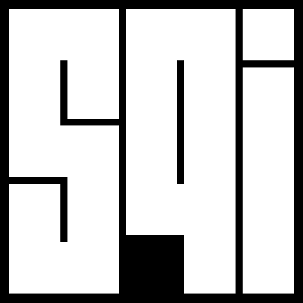

# 

`sqi` (pronounced "sky") is an open source distributed task and render farm manager built for modern production pipelines. It is designed to run simply on a handful of local workstations and scale to hybrid on-premises and cloud infrastructure without changing how you work.

> **Status:** v0.2.0 (Phase 2) released. Builds on the Phase 1 core with products and presets as an authoring layer over OpenJD, a community preset-library integration, product-driven submission, additional path-translation modes, S3-compatible storage, compute locations, and in-application DCC submitters for Maya, Houdini, Nuke, and Blender. **Phase 3** (opt-in auth & multi-user) — identity complete, task isolation in progress. Contributions, feedback, and discussion welcome.

---

## Why `sqi` exists

The render farm management space is in an awkward moment. Legacy on-premises systems are aging out of active development. The primary cloud-native alternative requires deep AWS infrastructure investment, locks you into a single provider, and introduces workflow constraints that don't match production realities. A lot of studios are looking for a third option.

`sqi` is that option. It draws on years of experience building and operating Smedge (Uberware's long-running render farm product) and applies those lessons to a clean, modern architecture that works wherever your compute lives — local network, cloud, or both.

---

## Design goals

**Simple by default.** A single binary gets a working farm. Workers on other machines run a second binary and can find the server automatically. No external database, no message broker configuration, no cloud account required to get started.

**Scalable when needed.** The same software that runs your five-machine studio farm can be deployed in a distributed, high-availability configuration with a separate database, message broker, and workers across multiple cloud providers. The upgrade path is configuration, not migration.

**Not tied to any cloud provider.** Workers run on Linux, macOS, and Windows — bare metal, VMs, or containers. Cloud compute locations are supported across AWS, GCP, Azure, and any provider that can run a container or a binary. Your control plane runs where you want it.

**OpenJD compatible.** `sqi` adopts the [Open Job Description](https://github.com/OpenJobDescription/openjd-specifications) format as its native job execution layer. Jobs authored for OpenJD-compatible tools work with `sqi` without reformatting. This is a real standard designed for portability, not a proprietary format.

**General purpose.** Rendering is the primary use case and the domain `sqi` is designed around, but the job model is general. Any workload expressible as a command with defined inputs, outputs, and environment is a valid `sqi` job — simulation, transcoding, machine learning pipelines, data processing, software development, or anything else a studio runs at scale.

---

## Key features

- **Farms and queues** organize work hierarchically. Configuration — scheduling policy, worker affinity, usage pool limits — can be set at the farm level and overridden per queue, so you're not repeating yourself on every job submission. Storage doesn't need this: a storage location already maps each compute location to its own root path, so jobs resolve the right path wherever they run without per-queue configuration.

- **Products and presets** are the authoring layer above raw job descriptions. A product defines a class of work (an Arnold render, a Houdini sim, an ffmpeg transcode) in terms of user-friendly parameters and how they map to commands. A preset is a ready-to-use product definition for a specific tool, installable from a community library directly through the web UI.

- **Community preset library** is a public repository of product presets covering major DCCs — Arnold, Blender, Houdini, Maya, Nuke, After Effects, Cinema 4D, and more. Browse, install, and customize presets from within the `sqi` interface. Community contributions welcome.

- **Named storage locations** provide a clean abstraction over where data lives. A location named `nas_shows` might resolve to `/mnt/nas/shows` on a local Linux worker, `Z:\shows` on a Windows worker, and `s3://studio-bucket/shows` on a cloud instance. Jobs reference location names; workers resolve them. Built-in support for S3-compatible object storage (AWS S3, Backblaze B2, Cloudflare R2, MinIO, and others).

- **Path translation** handles the fact that different applications deal with cross-platform and cross-environment paths differently. Product definitions declare how paths should be resolved — baked into the command line, passed as remapping arguments, set as environment variables, or staged locally before execution.

- **Usage pool management** tracks concurrent usage of any shared, finite resource across all workers. Tell `sqi` you have 20 Arnold render licenses (or a per-show task cap, or any other limit) and it ensures no more than that many tasks run at once, globally, across every compute location. Bring-your-own-limit — `sqi` enforces your cap, not its own.

- **Pull-based workers** register with the farm and pull assigned tasks rather than receiving pushed assignments. Workers can be added, removed, and scaled without the scheduler needing to manage their lifecycle. This makes auto-scaling and ephemeral cloud workers straightforward.

- **Layered authentication** — from no auth at all (local network trust, appropriate for small private farms) through local accounts, API keys, role-based access control, LDAP/Active Directory, and OAuth2/OIDC for SSO. Designed so simple deployments stay simple and enterprise deployments get what they need. Auth is **off by default**: set `auth.enabled: true` to turn it on, and see [the auth guide](auth.md) for the model, roles, and identity-provider setup.

- **Web UI** is the primary interface. No required desktop application. Real-time job and worker status, log streaming, preset management, product configuration, and farm administration — all in a browser.

- **DCC submitters** for Maya, Houdini, Nuke, and Blender via the [`sqi-submitter`](dcc-submitters.md) Python package — in-application submission with per-host scene extraction and pre-fill, built on top of the [`sqi-sdk` Python library](python-client.md), which covers scripted submission and pipeline integration on its own.

- **Optional LLM integration** (disabled by default) adds natural-language interfaces for farm management — explain a job failure in plain English, manage workers or job priorities by description, filter and search jobs conversationally. Pluggable provider model: bring your own API key (OpenAI, Anthropic, Azure, or a local Ollama instance). `sqi` never requires or bundles an AI service.

---

## Deployment

**All-in-one (simple mode)**

```sh
sqi-server          # runs the scheduler, API, web UI, everything
sqi-worker          # run on each render node — finds the server automatically
```

On a local network, workers discover the server via mDNS and connect without any configuration. Open a browser, start submitting. That's it.

There is no authentication in this mode — the server trusts the local network, by design. To require logins, set `auth.enabled: true` and see [the auth guide](auth.md), which covers the first-admin bootstrap, roles, API keys, and connecting a directory or SSO provider.

See the [Quickstart](quickstart.md) for a full walkthrough (binary or Docker Compose), including creating a farm and queue and submitting your first job.

**Distributed (production mode)**

A planned configuration (Phase 4) for high availability: a standalone NATS message broker and PostgreSQL for durable state, with workers connecting to the broker directly. The same binaries will support this mode; PostgreSQL, the HA scheduler, and Kubernetes manifests are not yet implemented. Today, deployment uses the single-binary or Docker Compose simple mode above.

Both modes run the same software. The difference is configuration.

---

## Status and roadmap

`sqi` v0.1.0 delivered the Phase 1 core: scheduler, pull-based workers, OpenJD job execution, and a basic web UI, with a Python client and single-binary or Docker Compose deployment. v0.2.0 completes Phase 2 — products and presets as an authoring layer over OpenJD, the community preset-library integration, a product-driven submission form, additional path-translation modes, S3-compatible storage, compute locations, and in-application DCC submitters for Maya, Houdini, Nuke, and Blender. **Phase 3** — opt-in authentication and multi-user support: local accounts and API keys, role-based access control, an authenticated owner/submitter identity on jobs, LDAP/Active Directory, OAuth2/OIDC SSO, and queue-scoped run-as-user task isolation (tasks execute as a distinct, unprivileged OS account instead of the worker's own — POSIX only, Windows not yet supported) — is complete and merged on `main`, unreleased. Auth is off by default, so an existing deployment is unaffected until enabled. Production-hardening features (Phase 4) follow.

This is a real project with a concrete development commitment, not a design document waiting for funding. Feedback on priorities is welcome — [open an issue](https://github.com/uberware/sqi/issues/new) or [start a discussion](https://github.com/uberware/sqi/discussions/new/choose).

See the [roadmap](roadmap.md) for more information about the design and implementation plan.

---

## Contributing

Contributions are welcome at all stages — code, preset definitions, documentation, bug reports, and design discussion.

The community preset library in particular benefits from people who know their tools well. If you have a working submission setup for a DCC or tool and want to share it as a `sqi` preset, that's a valuable contribution that doesn't require any Go or server-side knowledge.

See [CONTRIBUTING.md](contributing.md) for guidelines.

---

## License

`sqi` is licensed under the [GNU Affero General Public License v3.0](https://github.com/uberware/sqi/blob/main/LICENSE) (AGPL-3.0). This means you can use, modify, and self-host `sqi` freely. If you offer `sqi` (or a modified version) as a network service, the AGPL requires you to make your source available.

A commercial license is available for organizations that require it. Contact [robin@uberware.net](mailto:robin@uberware.net).

---

## About

`sqi` is built by [Uberware](https://www.uberware.net), the company behind [Smedge](https://www.uberware.net/smedge), a render farm manager with over two decades of production use. `sqi` is a clean-break successor designed for the infrastructure realities of the next decade.
